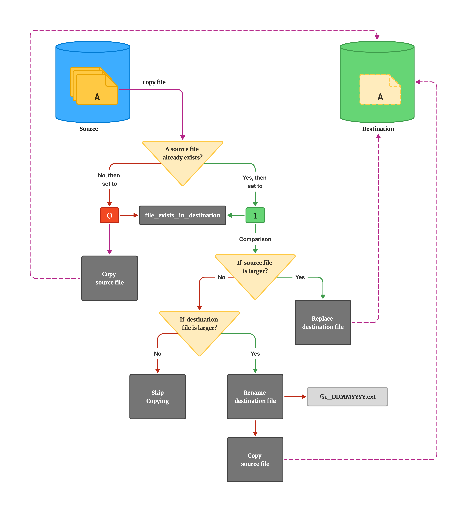

# Behind the Scripts

## `cp_file_w_pbar.py`

### 1. Check if the specific source file already exists in the destination directory

- False: No, does not exist: Simply copy source to destination.

* True: Yes, compare files and proceed based on criteria

### 2. When comparing files:

- I should compare size for now. _Though in the future I can implement modified date, content check (hash check) comparison_

* If source file is larger: Replace destination (Yes, a new file can have less data)
* If destination file is larger: Rename destination file (file\__YYYYMMDD_HHMM.bck_) and copy the source file
* If identical size: Skip copying.

### 3. I should include Error Handling:

- Permission issues
- Disk space constraints
- Read/write errors
- Interrupted operations

### Basic File Copy Procedure

